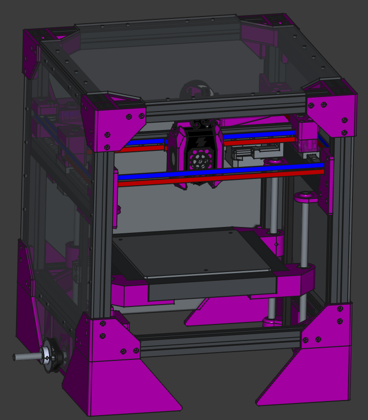

# Rudy 2

### This is a scalable build - access the frame configurator here [link](https://www.ungineers.com/razor/rudy2/configurator)

__IMPORTANT__ frame parts are not in this list, supply them from the configurator

---

### Before you start building, check the `mods/` folder for alternative setups

## BOM

__IMPORTANT__ 

Since this build is highly customizable, the BOM doesn't include specific parts for your toolhead choice, your bed choice and your bed probe choice.

My advice is to use 
 - anthead
 - klicky included in the steps folder
 - sherpa mini

These can be built with an assortment of M3 screws, 5mm OD heated inserts, a cheap bmg kit, 6x3mm magnets and a mouse switch.

---

#### hardware

_amounts for these are somewhat arbitary, they mostly mean "a handful" or "a lot"_

| thing | # |
|---|---|
| M3x6mm | 200 |
| M3x8mm | 100 |
| M3x30mm | 12 |
| M5x35mm | 12 |
| M5x20mm | 2 |
| M3 hex nut | 12 |
| M5 hex nut | 2 |
| M3 slide nut | 200 |
| whatever screws your bed uses ~40mm | |
| F695 bearing | 30 |
| LM8UU bearing | 4 |
| 608 bearing | 2 |
| 20T GT2 pulley - 5mm | 3 |
| 20T GT2 pulley - 8mm | 2 |
| 60T GT2 pulley - 8mm | 1 |
| GT2 belt | ~20x bed size |

#### electronics

_you can really pick anything you like here, I'll give you a setup that's cheap and works well_

_recommended brand for motors is OMC (stepperonline)_

| thing | # |
|---|---|
| Nema17 - any size | 2 |
| Nema17 - 34mm | 1 |
| Nema14 (extruder) | 1 |
| BTT Pico _or_ Mellow Micro4 | 1 |
| EBB36 CAN board | 1 |
| Orange Pi Zero 2W _or_ 3W | 1 |
| Meanwell Power supply ~350W | 1 |